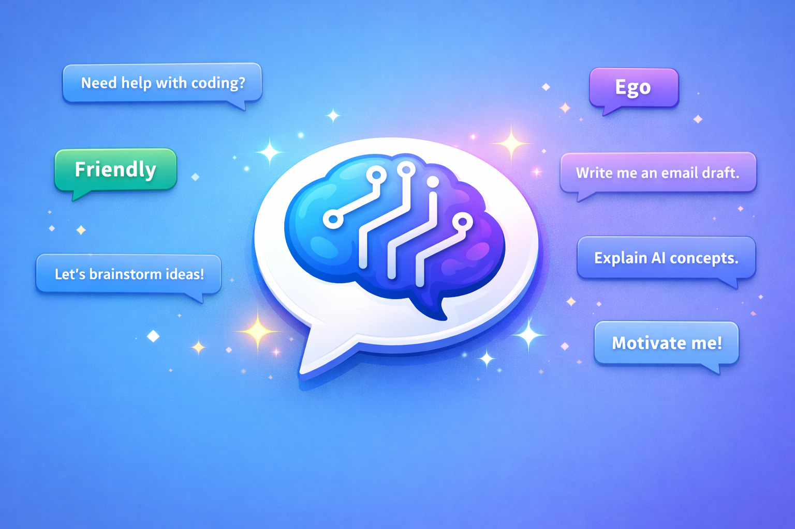

# TriPersona 🤖

A multi-persona AI chatbot with three distinct personalities, built with Flask, Groq (LLaMA 3.1), and Firebase.

🌐 **Live Demo:** [tripersona.onrender.com](https://tripersona.onrender.com)
💼 **LinkedIn Post:** [View on LinkedIn](https://www.linkedin.com/feed/update/urn:li:activity:7438602345040572416/)



## 🧠 Personas

| Persona | Personality |
|--------|-------------|
| **Normal** | Helpful, clear, and concise — your everyday AI assistant |
| **Friendly** | Warm, casual, and encouraging — like talking to a friend |
| **Ego** | Intense and driven — inspired by Isagi Yoichi from Blue Lock, pushes you to be your best |

## 🛠️ Tech Stack

- **Backend** — Python, Flask
- **AI** — Groq API (LLaMA 3.1 8B Instant)
- **Database** — Firebase Realtime Database (via Firebase Admin SDK)
- **Deployment** — Render
- **Frontend** — Vanilla HTML, CSS, JavaScript

## ✨ Features

- Three AI personas with separate conversation memory per session
- User name + timestamp saved to Firebase Realtime Database on every visit — real user tracking out of the box
- Bounded conversation history (max 25 messages per agent)
- Clean, dark-themed UI with background theming per persona
- Deployable on Render with environment-based Firebase credentials

## 🚀 Getting Started

### 1. Clone the repo

```bash
git clone https://github.com/your-username/TriPersona.git
cd TriPersona
```

### 2. Install dependencies

```bash
pip install -r requirements.txt
```

### 3. Set up environment variables

Create a `.env` file in the root directory:

```env
GROQ_API_KEY=your_groq_api_key

FIREBASE_DATABASE_URL=https://your-project-default-rtdb.firebaseio.com
FIREBASE_SERVICE_ACCOUNT_PATH=serviceAccountKey.json

FIREBASE_API_KEY=your_firebase_api_key
FIREBASE_AUTH_DOMAIN=your_project.firebaseapp.com
FIREBASE_PROJECT_ID=your_project_id
FIREBASE_STORAGE_BUCKET=your_project.appspot.com
FIREBASE_MESSAGING_SENDER_ID=your_sender_id
FIREBASE_APP_ID=your_app_id
```

### 4. Add your Firebase service account

Download `serviceAccountKey.json` from Firebase Console → Project Settings → Service Accounts and place it in the root directory.

> ⚠️ Never commit this file. It's already in `.gitignore`.

### 5. Run locally

```bash
python chatbot.py
```

Visit `http://localhost:5000`

## ☁️ Deploying to Render

1. Push your code to GitHub
2. Create a new **Web Service** on Render
3. Set the following environment variables in Render:
   - All variables from your `.env`
   - `FIREBASE_SERVICE_ACCOUNT_JSON` — paste the full contents of `serviceAccountKey.json`
4. Set the start command to:
   ```
   gunicorn chatbot:app
   ```

## 📁 Project Structure

```
TriPersona/
├── chatbot.py          # Flask backend + AI logic + Firebase
├── start.html          # Landing page (name entry)
├── chat.html           # Chat interface
├── static/
│   ├── start.png       # Background for landing page
│   ├── dark.png        # Ego persona background
│   ├── friendly.png    # Friendly persona background
│   └── light.png       # Normal persona background
├── .env                # Environment variables (not committed)
├── serviceAccountKey.json  # Firebase credentials (not committed)
├── requirements.txt
└── .gitignore
```

## 🔐 Security Notes

- `.env` and `serviceAccountKey.json` are excluded via `.gitignore`
- On Render, Firebase credentials are passed as an environment variable (`FIREBASE_SERVICE_ACCOUNT_JSON`) — no files needed in production

## 📄 License

MIT
